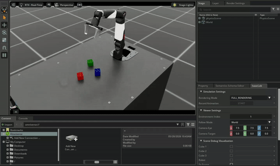

# 在 IsaacLab 环境中使用Piper和Nero进行遥操作数据采集

本项目在 [IsaacLab](https://github.com/isaac-sim/IsaacLab) 环境中实现了 **Piper和Nero机械臂的方块堆叠任务**，支持通过遥操作进行人类演示数据的采集与回放，并提供自动化采集数据的脚本用于高效采集演示数据。该项目作为 IsaacLab 的外部项目构建。




## 安装

### 1. 前置要求
- 已安装并配置好 Isaac Sim 和 IsaacLab。
- IsaacLab 安装对应的名为 `isaaclab` 的 Conda 虚拟环境。

### 2. 安装项目
``` bash
git clone https://github.com/szyzp/IsaacLab_Data_Collection.git
cd IsaacLab_Data_Collection
conda activate isaaclab
python -m pip install -e source/agx_teleop
```

## 使用指南

在进行数据采集之前，请确保已创建 `datasets` 文件夹：
```bash
mkdir -p datasets
```

### 手动采集演示数据
使用键盘作为输入设备，手动录制10条成功的演示数据。  
可选任务环境：
- Piper机械臂任务环境：`Isaac-Stack-Cube-Piper-IK-Rel-v0`
- Nero机械臂任务环境：`Isaac-Stack-Cube-Nero-IK-Rel-v0`
```bash
python scripts/tools/record_demos.py \
    --task Isaac-Stack-Cube-Piper-IK-Rel-v0 \
    --device cpu \
    --teleop_device keyboard \
    --dataset_file ./datasets/dataset.hdf5 \
    --num_demos 10
```
*(可选遥操作设备 `--teleop_device`: `keyboard`, `spacemouse`, `handtracking`)*

### 自动采集演示数据
``` bash
python scripts/tools/record_ik_stack.py \
  --task Isaac-Stack-Cube-Piper-IK-Rel-v0 \
  --device cuda \
  --dataset_file ./datasets/ik_dataset.hdf5 \
  --num_demos 10
```
*(可选`--headless`参数在无可视化服务器自动采集演示数据)*

### 回放演示数据
回放并验证刚才收集的`.hdf5`数据集。
```bash
python scripts/tools/replay_demos.py \
    --task Isaac-Stack-Cube-Piper-IK-Rel-v0 \
    --device cpu \
    --dataset_file ./datasets/dataset.hdf5
```

## 键盘遥操作控制方法

如果在启动录制时使用 `--teleop_device keyboard`，请在运行环境处于激活状态时使用以下按键控制机械臂（基于 SE(3) 控制）：

| 操作 | 快捷键 |
| :--- | :---: |
| **重置所有指令** | `R` |
| **开关夹爪**    | `K` |
| **沿 X 轴移动** | `W` / `S` |
| **沿 Y 轴移动** | `A` / `D` |
| **沿 Z 轴移动** | `Q` / `E` |
| **绕 X 轴旋转** | `Z` / `X` |
| **绕 Y 轴旋转** | `T` / `G` |
| **绕 Z 轴旋转** | `C` / `V` |

> **回放时的快捷键**：
> - 暂停回放: `B`
> - 恢复回放: `N`


## 参考项目
1、[IsaacLab官方教程](https://isaac-sim.github.io/IsaacLab/main/index.html)  
2、[IsaacLab](https://github.com/isaac-sim/IsaacLab)