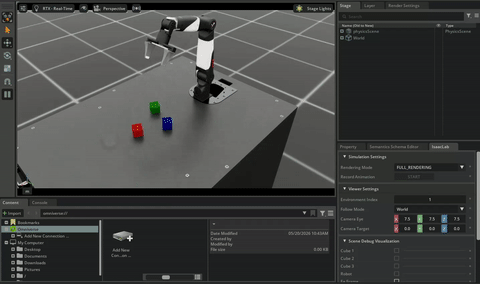

# Teleoperation Data Collection with Piper and Nero in IsaacLab

This project implements a **cube-stacking task for the Piper and Nero robotic arms** in the [IsaacLab](https://github.com/isaac-sim/IsaacLab) environment. It supports the collection and replay of human demonstration data through teleoperation, and also provides an automated data collection script for efficiently gathering demonstration data. This project is built as an external project for IsaacLab.

[](README_EN.md)
[](README.md)




## Environment Setup

### 1. Installation
- Ubuntu 22.04
- Python 3.11
- Torch 2.7.0
- Cuda 12.8
- IsaacLab v2.3.2
- IsaacSim v5.1.0

The following commands install the dependencies on Ubuntu 22.04:
``` bash
conda create -n isaaclab python=3.11 -y
conda activate isaaclab
pip install --upgrade pip

pip install torch==2.7.0 torchvision==0.22.0 torchaudio==2.7.0 --index-url https://download.pytorch.org/whl/cu128
pip install "isaacsim[all,extscache]==5.1.0" --extra-index-url https://pypi.nvidia.com
isaacsim	# Verify the IsaacSim installation

cd path/to/IsaacLab_path  # Change this to your IsaacLab installation path
git clone -b v2.3.2 https://github.com/isaac-sim/IsaacLab.git
sudo apt install cmake build-essential
cd IsaacLab
./isaaclab.sh --install robomimic
python scripts/tutorials/00_sim/create_empty.py	 # Verify the IsaacLab installation

cd path/to/IsaacLab_Data_Collection_path  # Change this to your data collection code installation path
git clone https://github.com/szyzp/IsaacLab_Data_Collection.git
cd IsaacLab_Data_Collection
python -m pip install -e source/agx_teleop
```

### 2. Possible Installation Issues
#### Error when verifying the IsaacLab installation
- Error message: `ModuleNotFoundError: No module named 'isaaclab'`
- Use `conda list isaaclab` to check whether the framework is installed. If the `isaaclab` subpackage is missing, the output is:
  ``` bash
  # Name                     Version          Build            Channel
  isaaclab-assets            0.2.4            pypi_0           pypi
  isaaclab-contrib           0.0.2            pypi_0           pypi
  isaaclab-mimic             1.0.16           pypi_0           pypi
  isaaclab-rl                0.4.7            pypi_0           pypi
  isaaclab-tasks             0.11.12          pypi_0           pypi
  ```
- Solution:
  ``` bash
  grep -n flatdict source/isaaclab/setup.py	  # Output 45:    "flatdict==4.0.1",
  sed -i 's/flatdict==4\.0\.1/flatdict==4.1.0/' source/isaaclab/setup.py	# Change it to flatdict==4.1.0
  grep -n flatdict source/isaaclab/setup.py	  # Check whether the change succeeded
  ./isaaclab.sh --install robomimic	          # Run the installation again
  conda list isaaclab	                        # Check whether isaaclab exists
  python scripts/tutorials/00_sim/create_empty.py	 # Verify the IsaacLab installation again
  ```

## Usage Guide

Before collecting data, make sure the `datasets` folder has been created:

```bash
mkdir -p datasets
```

### Manually Collect Demonstration Data

Use the keyboard as the input device to manually record 10 successful demonstrations.

Available task environments:
- Piper robotic arm task environment: `Isaac-Stack-Cube-Piper-IK-Rel-v0`
- Nero robotic arm task environment: `Isaac-Stack-Cube-Nero-IK-Rel-v0`

```bash
python scripts/tools/record_demos.py \
    --task Isaac-Stack-Cube-Piper-IK-Rel-v0 \
    --device cpu \
    --teleop_device keyboard \
    --dataset_file ./datasets/dataset.hdf5 \
    --num_demos 10
```

*(Optional teleoperation devices for `--teleop_device`: `keyboard`, `spacemouse`, `handtracking`)*

### Automatically Collect Demonstration Data

```bash
python scripts/tools/record_ik_stack.py \
  --task Isaac-Stack-Cube-Piper-IK-Rel-v0 \
  --device cuda \
  --dataset_file ./datasets/ik_dataset.hdf5 \
  --num_demos 10
```

*(Optionally add the `--headless` argument to automatically collect demonstration data on a server without visualization.)*

### Replay Demonstration Data

Replay and verify the collected `.hdf5` dataset.

```bash
python scripts/tools/replay_demos.py \
    --task Isaac-Stack-Cube-Piper-IK-Rel-v0 \
    --device cpu \
    --dataset_file ./datasets/dataset.hdf5
```

## Keyboard Teleoperation Controls

If `--teleop_device keyboard` is used when starting the recording script, use the following keys to control the robotic arm while the running environment is active. The control is based on SE(3) control.

| Action | Shortcut |
| :--- | :---: |
| **Reset all commands** | `R` |
| **Open/close gripper** | `K` |
| **Move along the X-axis** | `W` / `S` |
| **Move along the Y-axis** | `A` / `D` |
| **Move along the Z-axis** | `Q` / `E` |
| **Rotate around the X-axis** | `Z` / `X` |
| **Rotate around the Y-axis** | `T` / `G` |
| **Rotate around the Z-axis** | `C` / `V` |

> **Shortcuts during replay**:
> - Pause replay: `B`
> - Resume replay: `N`


## References

1. [IsaacLab Official Documentation](https://isaac-sim.github.io/IsaacLab/main/index.html)  
2. [IsaacLab](https://github.com/isaac-sim/IsaacLab)
